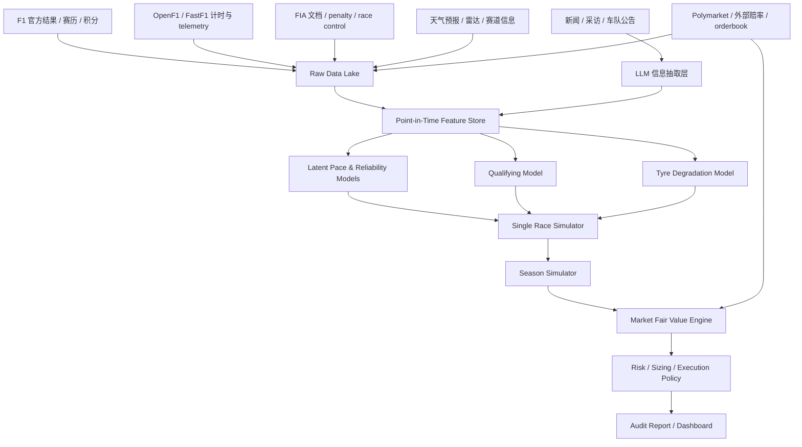

# F1 预测与交易 Edge 系统关键架构设计报告

生成日期：2026-07-01，Asia/Shanghai

> 本报告是架构设计与研究路线，不是实盘交易建议，也不是 formal edge 结论。当前项目已有端到端 MVP、诊断回放、预测包、市场/来源 readiness、校准报告和前端审计面板，但 replay 仍是 `diagnostic_only`：缺少同一时间点市场快照、部分历史来源仍需 cutoff-valid archive proof，模拟器还需要历史 lap/stint 校准。

## 0. 结论摘要

这个项目值得做，但不能做成“LLM 读新闻后猜谁赢”。更稳健的架构是：

```text
结构化 F1 数据 + 非结构化信息抽取 + 统计概率模型 + 单站比赛仿真 + 赛季仿真 + 市场定价/风控
```

LLM 的位置应当是信息处理层：读取新闻、采访、FIA 文件、天气、升级包、市场规则和结算条款，把它们转成带证据、置信度和时间戳的结构化特征。最终输出概率的核心应当是可校准的统计模型和 Monte Carlo 仿真，而不是 LLM 的直接判断。

第一阶段推荐只做四类市场族：

1. 车手年度冠军概率。
2. 车队年度冠军概率。
3. 下一站 winner / podium / pole / points finish。
4. 下一站 head-to-head / constructor props。

系统最重要的成功标准不是命中几场冷门，而是长期满足：

```text
概率校准好
log loss / Brier score 优于基准
买入后经常获得 closing line value
扣除费用、点差、滑点后仍有正期望
回测严格遵守当时可知信息，不能穿越
```

本轮调研对附件观点的确认：方向正确，尤其是“LLM 不直接猜胜负，而是把非结构化信息转成可审计特征”。需要补强的是工程门禁：所有输入必须 point-in-time，所有市场价格必须带 orderbook/fee/slippage 语境，所有概率必须经过校准报告和 matched baseline 对照后才能谈 edge。

## 1. 目标与边界

### 1.1 业务目标

目标是构建一个可以持续评估 F1 事件概率的预测系统，用于发现 Polymarket 或外部赔率中的错误定价。系统应能覆盖单站预测和全年积分/冠军预测，并能利用 LLM 处理非结构化信息。

核心输出不是“下注建议文本”，而是一组可审计对象：

```json
{
  "market_id": "polymarket_or_external_market_id",
  "event": "British GP - Driver Winner",
  "outcome": "George Russell",
  "model_probability": 0.284,
  "market_probability": 0.230,
  "edge_before_cost": 0.054,
  "estimated_cost": 0.018,
  "edge_after_cost": 0.036,
  "recommendation": "maker_only",
  "stake_fraction": 0.0025,
  "evidence": [
    "FP2 medium-tyre long-run adjusted pace ranked P1",
    "weather scenario increases Mercedes race-pace advantage",
    "orderbook spread too wide for taker execution"
  ],
  "counter_evidence": [
    "qualifying volatility remains high",
    "safety-car timing risk benefits faster starters behind"
  ],
  "generated_at": "2026-07-04T12:00:00+08:00",
  "knowledge_cutoff": "2026-07-04T11:45:00+08:00"
}
```

### 1.2 明确不做什么

第一阶段不建议：

- 不做自动大额实盘执行。
- 不让 LLM 直接输出交易概率。
- 不只预测单站冠军。
- 不用赛后信息回填赛前特征。
- 不把没有同口径历史回放验证的结果称为已经具备可决策优势。

## 2. 外部调研要点

### 2.1 F1 数据源

可用数据源可以分成三层。

| 层级 | 数据源 | 作用 | 主要风险 |
|---|---|---|---|
| 官方结算源 | F1 官方 results / standings / calendar，FIA regulations / documents | 当前积分、赛历、官方分类、规则、处罚、结算依据 | 页面结构变化、PDF 更新、赛后处罚版本管理 |
| 工程计时源 | OpenF1、FastF1 | lap time、sector、telemetry、weather、race control、pit/stint、position | 非官方授权边界、历史覆盖期、实时权限、数据延迟 |
| 市场源 | Polymarket CLOB、外部 bookmaker odds API | 价格、orderbook、盘口、历史价格、closing line | 低流动性、费用变化、spread、盘口定义不一致 |

本轮重新核对后的数据源判断：

- OpenF1 适合做 live/race-week 与历史计时底座。其主页列出 18 个 endpoint，覆盖 car telemetry、lap times、race positions、pit stops、team radio、weather、race control、championship standings；FAQ 说明历史数据从 2023 赛季起可用，实时数据通常约 3 秒延迟，默认 JSON/CSV，并明确它是非官方、社区项目，许可和商业使用边界必须单独审查。
- FastF1 适合做 Python 特征工程与研究复现底座，官方文档定位为访问和分析 F1 timing data、telemetry、race results 的 Python package，适合抽取 laps、telemetry、weather、messages、session results、championship standings。
- FIA 规则页是规则版本和结算/处罚语境的权威入口。FIA regulation archive 已列出 2026 Section A/B/C/D/E/F 等多个 2026-06-25 发布版本，因此规则解析必须记录 regulation issue、published_at 和 archive path，不能把“当前规则”回填到旧 cutoff。
- Polymarket 价格在概念上是概率，但其文档明确使用 CLOB，displayed price 可能是 bid-ask midpoint；当 spread 大于 0.10 时会显示 last traded price。因此交易引擎必须读取 order book，而不能只拿页面展示价。
- Polymarket fee 文档显示 Sports taker fee rate 为 0.03，maker fee 为 0；fee 公式与价格相关，100 shares 在 50% 附近 Sports taker fee 约 0.75 USDC。所有 edge 必须扣除 fee、spread、slippage、资金占用和模型误差缓冲。
- Polymarket price history API 可以按 market、startTs、endTs、interval、fidelity 拉历史价格；这支持我们做 cutoff 市场快照 backfill，但只有在 market definition/token id 经人工或规则引擎确认后才能进入正式 replay。

### 2.2 建模范式

已有公开研究支持以下方向：

- 用 Bayesian multilevel rank-ordered logit 拆分 F1 车手能力与车队优势。
- 用 normal-model baseline 量化车队/车手合理表现区间；这类简单基准不一定最强，但非常适合作为模型复杂化之前的 sanity baseline。
- 用 state-space model 建模轮胎衰退，把圈速分解成燃油效应、隐藏轮胎状态和观测噪声。
- 用 pit window / strategy decision support 建模进站时机。
- 用 Plackett-Luce / Bradley-Terry / Elo 类模型处理排名与成对胜负。

这些方向说明：F1 更适合“结构化拆解 + 概率仿真”，而不是黑箱分类器直接预测 winner。

公开研究给我们的架构启发：

- 车队效应非常强，任何年度模型都必须显式分离 constructor advantage 与 driver effect；否则会把同队车手的共同车速误判成个人能力。
- 轮胎退化适合做 latent state，而不是简单线性圈龄惩罚；pit stop 应视为 state reset。
- 进站/策略模型可先从规则化 simulator 开始，再用 FastF1/OpenF1 历史 stint 数据训练 pit-window policy。
- 复杂模型必须长期和 normal/Elo/market-only/odds-only 基准做 matched comparison；没有这个对照，复杂度本身不能说明 edge。

## 3. 总体架构



关键设计原则：

1. 所有特征必须有 `source_url`、`observed_at`、`available_at`、`confidence`。
2. 所有预测必须声明 `knowledge_cutoff`。
3. 所有回测必须从 point-in-time snapshot 重放，不能用当前修正后的数据冒充历史可知信息。
4. LLM 只产生结构化证据和候选参数更新；统计模型负责概率。
5. 市场决策必须扣除 fee、spread、slippage、流动性和模型误差缓冲。

### 3.1 当前仓库落地映射

当前 `F1Predict` 已经不是纯设计稿，建议按下面方式理解现有模块：

| 架构层 | 当前实现 | 下一步 |
|---|---|---|
| Raw Data Lake | `data/raw/` append-only snapshots，OpenF1/FastF1/F1 official/Polymarket/Open-Meteo/研究来源 | 给每个 raw dataset 补统一 `available_at` 与 license/usage metadata |
| Feature Store | `data/processed/`、`features/provider.py`、官方 standings parser、OpenF1 summaries、FastF1 previous-result features | 迁移到 DuckDB/Parquet 表，明确 feature horizon 和 cutoff policy |
| LLM Evidence Layer | `data/evidence/<event>/packets/`、`CodexEvidenceProvider`、source/evidence audit、quality scoring | 增加自动 market-rule parser、FIA document parser、claim conflict detector |
| Race Simulator | `SingleRaceSimulator`，已包含 grid、tyre deg、pit loss、weather、safety car、reliability，并输出 selected simulation replay | 用历史 lap/stint 数据校准参数，升级为 full lap-by-lap strategy engine |
| Season Simulator | `SeasonForecastSimulator`，以当前积分 + 剩余事件采样生成冠军概率 | 加入 sprint、development curve、PU penalty risk、team correlation |
| Market Engine | `MarketAnalyzer`、Polymarket search/normalize/live snapshot/history backfill、conservative calibration shrinkage | 补同一时间点市场快照，建立 CLV/PnL paper ledger |
| Readiness / Audit | chronological replay、formal readiness、calibration、improvement plan、freeze manifest | 只在 readiness 和 calibration 都 formal-ready 后才允许 edge claim |
| Frontend | 本轮已隐藏未视觉审计赛道图，替换错误 representative lap 为 selected simulation replay | 增加 market replay selector、probability calibration drilldown、source timeline |

## 4. 数据与存储设计

### 4.1 Raw Data Lake

存储原始数据，永不覆盖：

```text
raw/f1_official/standings/yyyy-mm-dd/*.json
raw/f1_official/calendar/yyyy-mm-dd/*.json
raw/fia/documents/yyyy-mm-dd/*.pdf
raw/openf1/{year}/{meeting}/{session}/{endpoint}.json
raw/fastf1/{year}/{event}/{session}/*.parquet
raw/weather/{provider}/{event}/{timestamp}.json
raw/news/{source}/{timestamp}.html
raw/polymarket/{market_id}/{timestamp}.json
```

### 4.2 Feature Store

推荐用 DuckDB/Parquet 开始，后续迁移到 Postgres + object storage。核心表：

| 表 | 粒度 | 说明 |
|---|---|---|
| `race_weekend` | event | 赛道、日期、sprint、天气区域、时区 |
| `session_laps` | driver-lap | 圈速、sector、compound、tyre life、track status |
| `stints` | driver-stint | compound、stint age、pit lap、degradation features |
| `telemetry_summary` | driver-session | speed trap、throttle/brake、corner cluster summary |
| `race_control_events` | event-time | SC/VSC/red flag/penalty/investigation |
| `weather_timeseries` | event-time | air/track temp、rainfall、wind、humidity |
| `news_evidence` | document-claim | LLM 抽取的升级、可靠性、策略、处罚、天气风险 |
| `market_snapshots` | market-time | bid/ask/mid/last/depth/spread |
| `model_predictions` | model-market-time | fair probability、uncertainty、calibration version |
| `trade_decisions` | decision-time | no trade / maker / taker、阈值、原因 |

### 4.3 时间旅行与知识截止

这是系统能否可信的核心。每个样本必须区分：

```text
event_time: 事情发生时间
published_at: 信息发布/页面更新/接口可见时间
ingested_at: 我们系统采集到的时间
available_at: 模型允许使用该信息的最早时间
```

之后要“把知识截止到上周，重新预测上周比赛”，就只需要指定：

```text
knowledge_cutoff = 上周比赛前某个具体时间点
```

系统自动只读取 `available_at <= knowledge_cutoff` 的特征和文档。

## 5. LLM 信息层设计

### 5.1 LLM 的正确职责

LLM 应做六件事：

1. 新闻/采访/车队公告结构化。
2. FIA 文档和 Polymarket 规则解析。
3. 天气预报转赛道状态场景。
4. 赛道特性描述转模型特征。
5. 生成概率变化的证据报告。
6. 扫描市场定义是否可建模、可结算、可交易。

LLM 不应直接负责：

- 直接给最终 fair probability。
- 在没有数据支撑时判断“谁会赢”。
- 改写历史可见时间。
- 自动下单。

### 5.2 抽取 Schema

新闻和公告统一抽取成：

```json
{
  "claim_id": "hash",
  "source": "source name",
  "source_url": "<source-url>",
  "published_at": "2026-07-01T09:30:00Z",
  "target_type": "team",
  "target_id": "mercedes",
  "claim_type": "upgrade | track_fit | power_unit | ers | aero | weight | reliability | strategy | weather",
  "metric": "energy_recovery",
  "component": "battery deployment",
  "direction": "positive",
  "magnitude": 0.07,
  "confidence": 0.68,
  "uncertainty": 0.12,
  "affected_metrics": [
    "race_pace",
    "race_execution",
    "qualifying_pace",
    "power_unit",
    "energy_recovery",
    "straight_line_speed",
    "drag_efficiency",
    "low_speed_traction",
    "weight",
    "upgrade_effect",
    "tyre_deg",
    "reliability",
    "strategy",
    "wet_skill"
  ],
  "affected_track_types": ["high_speed", "power"],
  "evidence_quote": "short excerpt within copyright limits",
  "reasoning": "why this source-backed mechanism maps to this metric on this circuit",
  "contradictions": [],
  "human_review_required": true
}
```

规则和结算抽取成：

```json
{
  "market_id": "abc",
  "settlement_source": "FIA Final Classification",
  "includes_post_race_penalties": true,
  "includes_later_dsq_after_final_classification": false,
  "cancellation_policy": "void_or_resolve_by_rules",
  "mutually_exclusive_group": "british_gp_winner",
  "ambiguous_terms": [],
  "trade_allowed": true,
  "review_required": false
}
```

### 5.3 防幻觉机制

LLM 输出必须经过四道门：

1. JSON schema validation。
2. 来源 URL 和发布时间校验。
3. 与已有结构化事实冲突检测。
4. 高影响参数需要 human review 或多源确认。

任何没有来源、没有时间戳、不能落到模型参数的文本，都只能作为备注，不能进入预测模型。

## 6. 模型分层设计

### 6.1 V0：可快速上线的基准模型

V0 的目标是两周内跑出端到端系统，不追求极致精度。

组成：

```text
team_strength: Elo / Bradley-Terry
driver_strength: teammate-adjusted driver effect
track_type_adjustment: 手工 track cluster + 历史表现
qualifying_distribution: 历史 quali pace + 当前赛季 form
race_points_distribution: ranking model + DNF/reliability
season_simulator: 剩余赛历 Monte Carlo
market_engine: fair probability vs market price
```

V0 就应该能回答：

```text
某车手年度冠军 fair probability 是多少？
某车队年度冠军 fair probability 是多少？
下一站各车手 expected points 是多少？
当前 Polymarket 价格是否偏离足够大？
```

2026 规则变化必须进入 V0/V1 的 track-type 和 team coefficient。F1 官方 2026 规则解读强调新动力单元约 50/50 电能与内燃机功率分配、Overtake Mode、Active Aero、车身尺寸与重量变化；这些会让赛道类型从传统“高速/低速/街道”扩展到更细的能量部署、主动空动、冷却、再生制动和跟车/超车场景。第一版不需要完整物理模型，但必须给这些变量留接口。

### 6.2 Latent Pace Model

目标：估计车队/车手在给定赛道类型、轮胎、天气和 session 状态下的真实速度分布。

建议从层级模型开始：

```text
lap_time_delta =
  team_base_strength
  + driver_effect
  + teammate_gap
  + track_type_effect[team]
  + compound_effect
  + fuel_load_proxy
  + tyre_age_effect
  + track_evolution
  + traffic_penalty
  + weather_effect
  + upgrade_effect
  + error
```

可选实现：

- V0/V1：LightGBM / XGBoost + calibration。
- V1/V2：hierarchical Bayesian model，用于显式分离车队、车手、赛道类型和不确定性。
- 排名输出：Plackett-Luce / rank-ordered logit，用于 finishing distribution。

### 6.3 Tyre Degradation Model

轮胎是单站 edge 的重点。建议用 state-space 思路：

```text
observed_lap_time[t] =
  clean_air_pace
  + fuel_effect[t]
  + latent_tyre_state[t]
  + traffic_effect[t]
  + track_evolution[t]
  + driver_error[t]

latent_tyre_state[t+1] =
  latent_tyre_state[t]
  + degradation_rate[compound, track_temp, driver, team]
  + noise
```

pit stop 作为 tyre state reset。输出不只是平均胎衰，而是 stint pace distribution。

### 6.4 Qualifying Model

输入：

```text
FP low-fuel pace
historical qualifying gap
team/driver qualifying strength
track evolution
traffic/red-flag risk
weather window
tyre warm-up
power deployment / drag efficiency
```

输出：

```text
P(pole)
P(start P1-P3)
P(start P1-P5)
full grid distribution
```

排位结果会强烈影响 winner、podium、H2H 和年度积分期望。

### 6.5 Single Race Simulator

每次模拟一场比赛：

```text
1. sample qualifying / grid, or use known grid after qualifying
2. sample start reaction and lap-1 incidents
3. per-lap update clean-air pace, traffic, tyre, fuel, weather, DRS train
4. sample pit strategy and pit execution
5. sample SC/VSC/red flag/penalty/DNF
6. produce final classification and points
```

输出：

```text
P(win)
P(podium)
P(points)
P(top_6)
P(head_to_head)
P(fastest_lap_if_market_exists)
P(safety_car)
P(red_flag)
expected_points
```

### 6.6 Season Simulator

年度模型不应单独训练一个冠军分类器，而应把剩余分站串起来：

```text
current_standings
+ remaining_calendar
+ race_simulator for each event
+ sprint formats
+ reliability and PU penalty risk
+ upgrade/development curve
+ driver/team correlation
= season distribution
```

输出：

```text
P(driver_champion)
P(constructor_champion)
expected_final_points
P(champion_decided_before_event)
team/driver eliminated probability
```

### 6.7 Simulation Replay 与审计输出

单场概率不能只输出最终表格，还应输出一条可解释的 selected simulation replay，用于回答“这次 Monte Carlo 样本为什么这么排”。当前前端已改为展示：

```text
lap
driver_id
grid_position
position
gap_to_leader
cumulative_time
lap_time
compound
tyre_age
pit_stop
track_status
planned_stops
pit_laps
wet_race
safety_car_lap
reliability
dnf
```

这个 replay 不是正式预测证据，而是模型调试和产品解释层。它的作用是暴露 simulator 是否把关键因素纳入了路径：排位、交通、轮胎、进站、安全车、天气、可靠性。后续可以做“选定模拟回放”：用户从概率表选择某个 driver/outcome，前端展示若干代表性轨迹，例如 `winner_path`、`podium_path`、`DNF_path`、`safety_car_flip_path`。

## 7. 市场定价、交易与风控

### 7.1 市场概率处理

Polymarket 价格在概念上可解释为概率，但实盘不能直接用 displayed price。应计算：

```text
best_bid
best_ask
mid
last_trade
spread
depth_at_price
slippage_for_target_size
fee_rate
effective_entry_price
```

外部 bookmaker odds 需要去水：

```text
implied_p_i = 1 / decimal_odds_i
devigged_p_i = implied_p_i / sum(implied_p_all_outcomes)
```

### 7.2 交易门槛

交易条件：

```text
edge_after_cost =
  model_probability
  - effective_market_probability
  - taker_fee
  - spread_cost
  - slippage
  - uncertainty_buffer
  - funding_cost
```

建议阈值：

| 市场类型 | 最小 edge_after_cost | 执行偏好 |
|---|---:|---|
| 年度冠军高流动性市场 | 3-5pp | maker 优先，必要时小额 taker |
| 单站 winner/podium | 5-8pp | maker 优先 |
| H2H / constructor props | 4-7pp | 视流动性 |
| safety car / red flag | 8pp+ | 小仓，模型不确定性高 |
| 规则不清晰市场 | 不交易 | 需要人工审核 |

### 7.3 仓位

第一阶段只做纸面或很小仓。若实盘：

```text
stake = min(
  fractional_kelly(edge, odds, uncertainty),
  per_market_cap,
  per_driver_cap,
  per_team_correlated_cap,
  liquidity_cap
)
```

默认最多 1/4 Kelly，并对同队、同车手、年度/单站联动风险做合并敞口。

## 8. 回测与验证设计

### 8.1 Walk-forward 回测

推荐：

```text
train: 2023-2024
validation: 2025
paper/live shadow: 2026 后续分站
```

每个预测时点必须严格限制可用信息：

| 预测时点 | 可用信息 | 禁止信息 |
|---|---|---|
| 赛前 T-7/T-3 | 历史数据、赛道、天气预报、新闻、积分、市场价格 | FP/Qualifying/Race |
| FP2 后 | FP1/FP2、已发布新闻、市场价格 | FP3/Qualifying/Race |
| 排位后 | 排位、发车格、处罚、天气更新 | 正赛 |
| 正赛前 | 最新天气、轮胎分配、pit lane info、grid penalties | 正赛结果 |
| 赛后年度更新 | 官方分类、积分、处罚 | 未来新闻 |

### 8.2 评估指标

概率模型：

```text
Brier score
log loss
calibration curve
expected calibration error
rank probability score
```

交易模型：

```text
closing line value
profit after fees
max drawdown
Sharpe-like return / volatility
hit rate by market type
average edge by bucket
model probability vs Polymarket probability
model probability vs external bookmaker probability
```

### 8.3 基准模型

必须保留强基准，避免把复杂系统的噪声当 edge：

1. Market-only：直接用 Polymarket mid/closing line。
2. Odds-only：外部 bookmaker 去水概率。
3. Elo-only：车队/车手 Elo + 当前积分。
4. No-LLM structured-only：只用 OpenF1/FastF1/官方数据。
5. Full model：结构化 + LLM extracted features + 仿真。

只有 full model 在相同时间切分、相同市场、相同费用假设下稳定优于基准，才能说 LLM 信息层贡献了 edge。

### 8.4 Formal Edge Gate

系统允许展示诊断概率，但只有同时满足下面条件才允许在报告里写“edge”：

```text
same-time market snapshots complete
source snapshots inside cutoff or archive-backed
event input audit passes no-placeholder simulation-driving fields
probability calibration report is not diagnostic-only
market-only / odds-only / Elo-only / structured-only baselines are matched
fee/spread/slippage/funding/model-error buffer already deducted
decision packet carries reproducible payload hash
```

如果任一条件不满足，输出只能是诊断差异、研究信号或暂不行动，不能包装成“稳定盈利策略”。这条门禁比模型选择更重要，因为 F1 样本量小，事后解释很容易看起来合理。

## 9. MVP 实施路线

### Phase 0：项目骨架

目标：搭好数据与预测最小闭环。

交付：

```text
data ingestion scripts
raw snapshot storage
feature schema
baseline model config
season simulator
prediction report markdown/json
```

当前状态：第一阶段已基本完成，并且已经扩展出回放、就绪度、校准和冻结清单诊断链路。接下来不是继续堆界面，而是补齐未来做市场优势证明所需的同一时间点市场和来源数据。

### Phase 1：V0 赛季模型

目标：跑通年度车手/车队冠军概率。

范围：

```text
官方赛历和积分
历史比赛结果
简单 track cluster
team/driver Elo
DNF/reliability prior
Monte Carlo season simulator
Polymarket price comparison
```

### Phase 2：单站模型

目标：下一站 winner/podium/H2H。

范围：

```text
FastF1/OpenF1 lap data
quali/race pace features
stint and tyre degradation features
simple race simulator
qualifying update and race update
```

当前状态：已有 compact strategy-aware simulator 和 selected simulation replay；下一步要做历史 lap/stint 校准、qualifying distribution、SC/VSC/red-flag 模块、penalty/PU risk，并把 replay selector 暴露到前端。

### Phase 3：LLM/RAG 信息层

目标：将非结构化信息变成可用特征。

范围：

```text
news/FIA/team announcement ingestion
claim extraction schema
source/evidence validation
weather scenario extraction
market rule parser
audit report generator
```

### Phase 4：交易研究引擎

目标：纸面交易与 edge 验证。

范围：

```text
orderbook snapshots
effective price and fee model
maker/taker policy simulator
position/risk ledger
CLV and PnL dashboard
```

不建议在 Phase 4 之前做自动实盘。

## 10. 关键工程接口

### 10.1 Prediction API

```http
POST /predict/race
{
  "event_id": "2026_british_gp",
  "knowledge_cutoff": "2026-07-04T12:00:00Z",
  "markets": ["winner", "podium", "h2h", "pole"]
}
```

```http
POST /predict/season
{
  "season": 2026,
  "knowledge_cutoff": "2026-07-06T00:00:00Z",
  "markets": ["driver_champion", "constructor_champion"]
}
```

### 10.2 Report API

```http
GET /reports/market/{market_id}?at=2026-07-04T12:00:00Z
```

返回：

```text
fair probability
market price
edge decomposition
top evidence
counter evidence
rules summary
risk summary
recommended action
```

## 11. 主要风险

| 风险 | 影响 | 缓解 |
|---|---|---|
| 样本量小 | 模型过拟合、置信度虚高 | 分层模型、强先验、概率校准、市场基准 |
| 规则变化 | 历史规律失效 | track/team dynamic coefficients，赛季内快速更新 |
| LLM 幻觉 | 错误特征污染模型 | schema、source validation、human review |
| 数据穿越 | 回测虚高 | point-in-time snapshots，available_at 严格过滤 |
| 低流动性 | 纸面 edge 无法成交 | orderbook simulator，slippage cap |
| 费用/规则变化 | edge 被吞噬 | 每次交易前实时查询 fee/rules |
| 市场结算歧义 | 赢了比赛但市场未按预期结算 | LLM rule parser + 人工审核 |
| 法律/合规 | 实盘限制 | 先做研究与纸面交易，遵守所在地规则 |

## 12. 推荐技术栈

第一阶段：

```text
Python
DuckDB + Parquet
Pandas / Polars
FastF1
OpenF1 REST API
LightGBM / XGBoost
PyMC 或 NumPyro（后续）
Polymarket CLOB API
SQLite/Postgres for metadata
Markdown/HTML report
```

LLM/RAG：

```text
document fetcher
PDF parser
HTML cleaner
embedding vector store
JSON schema constrained extraction
source citation store
claim conflict detector
```

## 13. 对附件观点的整合与修正

附件的主方向是正确的：

- F1 有工程结构，适合拆解建模。
- LLM 应处理非结构化信息，不应直接猜胜负。
- 单站模型和年度模型应统一。
- 市场 edge 主要来自动态更新、跨市场不一致和小盘口粗糙定价。
- 回测必须关注 CLV 和费用后收益。

我建议补强四点：

1. 所有信息必须 point-in-time 化，否则无法做“知识截止到上周”的复盘。
2. LLM 抽取结果必须有 schema、来源、时间和置信度，不能直接进入交易。
3. full model 必须与 market-only、odds-only、Elo-only、structured-only 做 matched comparison。
4. 先纸面交易和报告，不先做自动实盘。

## 14. 最终建议

建议立项，第一版按下面路径做：

```text
先补 same-time market snapshots 与 source archive proof
再校准 V0/V1 单站 simulator
再把赛季仿真接入 calibrated event sampler
再增强 LLM/RAG 信息层和 market-rule parser
最后做纸面交易、CLV、PnL 与风控
```

第一份可交付产品应是每日/赛周概率报告：

```text
年度冠军概率曲线
下一站 winner/podium/H2H 概率
Polymarket 与外部赔率对比
edge after cost
证据链与反证
no trade / maker / taker 建议
回测与 CLV 追踪
```

这条路线比“直接训练一个冠军分类器”慢一点，但更可能形成可解释、可复盘、可迭代的预测研究系统；是否具备可决策优势需要在后续用更严格数据单独证明。

最短的下一步不是调参，而是建立 formal replay 输入闭环：

```text
1. 对未来每站在预测 cutoff 捕获 Polymarket orderbook 快照。
2. 对 completed replay 缺口补 cutoff-valid 市场快照或明确标记无法 formal replay。
3. 对仍是 retrospective 的来源补 archive proof 或替换成 cutoff 前来源。
4. 用 2023-2025 历史 lap/stint 校准 simulator 参数。
5. 每次概率报告都输出 prediction packet + calibration status + no-trade/diagnostic gate。
```

## 15. 参考来源

- [OpenF1 API documentation](https://openf1.org/docs/)
- [OpenF1 homepage and feature list](https://openf1.org/)
- [FastF1 documentation](https://docs.fastf1.dev/)
- [FastF1 current documentation](https://theoehrly-fast-f1.mintlify.app/)
- [FastF1 loading data documentation](https://theoehrly-fast-f1.mintlify.app/core-concepts/loading-data)
- [Formula 1 official 2026 calendar](https://www.formula1.com/en/racing/2026)
- [Formula 1 official 2026 drivers standings](https://www.formula1.com/en/results/2026/drivers)
- [Formula 1 official 2026 team standings](https://www.formula1.com/en/results/2026/team)
- [FIA Formula One regulations archive](https://www.fia.com/regulation/category/110)
- [Formula 1 beginner guide to 2026 regulations](https://www.formula1.com/en/latest/article/the-beginners-guide-to-the-2026-regulations.6j0tS0hrHG2T01tpmK6XYz)
- [Polymarket prices and orderbook concepts](https://docs.polymarket.com/concepts/prices-orderbook)
- [Polymarket fees](https://docs.polymarket.com/trading/fees)
- [Polymarket market data API overview](https://docs.polymarket.com/market-data/overview)
- [Polymarket get order book API](https://docs.polymarket.com/api-reference/market-data/get-order-book)
- [Polymarket price history API](https://docs.polymarket.com/api-reference/markets/get-prices-history)
- [The Odds API documentation](https://the-odds-api.com/liveapi/guides/v4/)
- [The Odds API homepage](https://the-odds-api.com/)
- [Bayesian Analysis of Formula One Race Results](https://arxiv.org/abs/2203.08489)
- [Benchmarking Formula 1 results using a normal model](https://arxiv.org/abs/2603.15192)
- [A State-Space Approach to Modeling Tire Degradation in Formula 1 Racing](https://arxiv.org/abs/2512.00640)
- [Data-driven pit stop decision support for Formula 1](https://pmc.ncbi.nlm.nih.gov/articles/PMC12626961/)
- [Data-driven pit stop decision support for Formula 1 using deep learning models](https://www.frontiersin.org/journals/artificial-intelligence/articles/10.3389/frai.2025.1673148/full)
- [Polymarket order book microstructure paper](https://arxiv.org/abs/2604.24366)
- [PolyBench: Benchmarking LLM Forecasting and Trading Capabilities](https://arxiv.org/abs/2604.14199)
