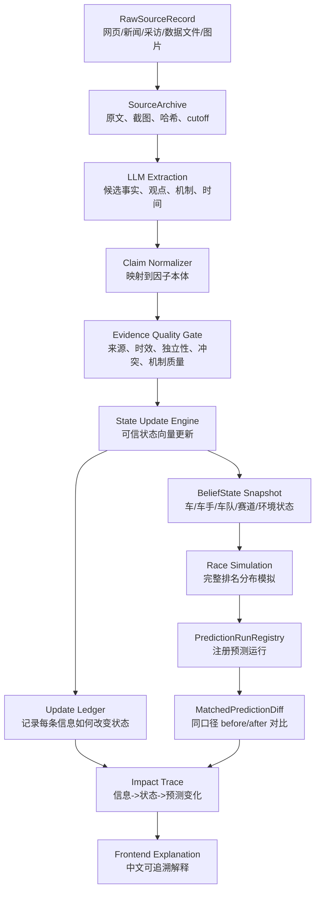

# 全流程可追溯预测更新架构设计

生成日期：2026-07-06

这份文档回答一个核心问题：

```text
一条原始非结构化信息，怎样可信地改变模型对赛车、车手、车队、赛道和比赛情境的判断，
又怎样证明它最终改变了每个车手的预测排名和概率？
```

它不是“给每条信息加来源和置信度”这么简单。真正需要的是一条完整链路：

```text
原始信息
-> 信息抽取
-> 事实/观点/机制拆分
-> 因子本体映射
-> 质量审计
-> 状态向量更新
-> 模拟参数更新
-> 预测结果改变
-> 前端可解释展示
```

## 1. 设计原则

第一，Codex/LLM 不直接给出“谁会赢”。它的职责是把网页、新闻、采访、技术分析、社交媒体、图片说明、赛事文档等非结构化材料，变成有来源、有机制、有适用范围的结构化信息。

第二，所有预测都先经过“状态向量”，不能让新闻直接改胜率。例如“Mercedes ERS 很强”不能直接写成 George Russell 胜率增加，而应该先进入 `CarPerformanceState.ers_deployment`、`CarPerformanceState.clipping_risk` 等字段，再由赛道需求和模拟器决定它对本场比赛的影响。

第三，每次信息更新都必须留下 before/after。系统必须能回答：

```text
这条信息进入前，模型认为 Mercedes ERS 状态是什么？
这条信息进入后，状态变成什么？
为什么变这么多？
它影响了哪些模拟参数？
同种子重跑后，哪些车手的排名分布发生了变化？
如果没有变化，为什么没有变化？
```

第四，没有来源、没有机制、没有时间戳、没有独立佐证的信息，只能作为弱提示或待复核，不允许强力改变预测。

第五，前端解释不能展示裸的内部权重。可以展示的是：事实、来源、方向、幅度等级、状态变化原因、预测差异结果。

第六，用户举例只能作为错误发现信号，不能作为训练标签或手动调参依据。如果用户指出“某队明显不该排这么高”，系统应该检查信息源、状态更新和模型映射，而不是写入某队/某车手的定向补丁。预测代码里不允许出现按具体车队或车手 id 改变预测结果的特判；实体事实必须进入数据层或证据层，并带来源、时间、质量审计和状态更新记录。

## 2. 总体链路



## 3. 需要新增的核心对象

### 3.1 RawSourceRecord

记录原始信息本身。

```python
RawSourceRecord:
    source_id
    source_type              # article, interview, timing_data, official_doc, image, social, video_transcript
    url
    title
    publisher
    author
    published_at
    captured_at
    knowledge_cutoff
    raw_text_path
    raw_html_path
    screenshot_path
    archive_url
    content_hash
    license_or_terms_note
```

它解决的问题是：以后不能只说“Codex 看到了某条新闻”，必须能回到原始材料。

### 3.2 ExtractedInformationUnit

LLM 从原始信息中提取出的最小信息单元。

```python
ExtractedInformationUnit:
    unit_id
    source_id
    extracted_at
    original_snippet
    paraphrase_zh
    information_type         # fact, quote, technical_claim, rumour, analysis, timing_observation
    target_text              # 原文中的目标对象
    time_scope               # 本站、最近几站、赛季初、长期
    certainty_language       # confirmed, likely, suggested, rumour
    llm_extraction_confidence
```

它解决的问题是：LLM 先抽取信息，不急着决定它对预测有多大影响。

### 3.3 NormalizedFactorClaim

把信息映射到统一因子本体。

```python
NormalizedFactorClaim:
    claim_id
    unit_id
    event_id
    target_type              # team, driver, car, event, track
    target_id
    factor                   # ers_deployment, tyre_deg, qualifying_pace...
    direction                # positive, negative, neutral
    magnitude_observation    # weak, medium, strong 或结构化观测值
    mechanism                # 为什么这个信息会影响该因子
    applicable_context       # high_speed_track, cold_weather, low_grip, wet_race...
    valid_from
    valid_until
    decay_policy
    extraction_status        # accepted, needs_review, rejected
```

这里要避免“泛泛乐观”。例如：

```text
错误：Red Bull 最近看起来更好了 -> Red Bull 胜率 +X
正确：Red Bull 最近两站低速牵引和轮胎窗口改善 -> low_speed_traction +，tyre_warmup +，适用于低速/中速弯多、低温窗口明显的赛道
```

### 3.4 EvidenceQualityProfile

质量审计不只是一句 confidence。

```python
EvidenceQualityProfile:
    claim_id
    source_reliability       # 来源历史可信度
    source_proximity         # 一手/二手/转述/猜测
    timestamp_validity       # 是否在 cutoff 前，是否过期
    specificity_score        # 是否具体到车队/部件/赛道/时间
    mechanism_score          # 是否解释了作用机制
    triangulation_score      # 是否有独立来源佐证
    conflict_score           # 是否与其他来源冲突
    data_support_score       # 是否被 timing/result 数据支持
    recency_weight           # 最近几站信息权重更高
    review_required
    model_update_permission  # blocked, weak_update, normal_update, strong_update
    reasons
```

这一步决定信息是否允许改变预测状态。

### 3.5 BeliefState

这是模型真正使用的“当前世界状态”。所有来源和信息最终都要更新这里，而不是直接更新胜率。

```python
BeliefState:
    state_id
    event_id
    knowledge_cutoff
    generated_at
    track_state
    car_states
    driver_states
    team_ops_states
    event_risk_state
    source_fingerprint
    update_fingerprint
```

#### CarPerformanceState

```python
CarPerformanceState:
    team_id
    overall_pace
    qualifying_pace
    race_pace
    high_speed_corner
    medium_speed_corner
    low_speed_corner
    traction
    mechanical_grip
    aero_efficiency
    drag
    straight_line_speed
    power_unit_peak
    ers_deployment
    ers_recovery
    clipping_risk
    cooling_margin
    tyre_deg
    tyre_warmup
    dirty_air_sensitivity
    setup_window_width
    reliability
    upgrade_delta
```

#### DriverPerformanceState

```python
DriverPerformanceState:
    driver_id
    qualifying_ceiling
    qualifying_consistency
    race_pace
    long_run_consistency
    tyre_management
    tyre_warmup
    wet_skill
    attack_racecraft
    defense_racecraft
    first_lap_gain
    incident_risk
    penalty_risk
    setup_feedback
    car_fit_understeer
    car_fit_oversteer
    team_priority
```

#### TeamOpsState

```python
TeamOpsState:
    team_id
    strategy_quality
    pit_stop_mean
    pit_stop_variance
    pit_wall_risk
    development_rate
    upgrade_correlation
    setup_quality
    internal_conflict_risk
```

## 4. 可信状态更新机制

### 4.1 状态不是一次性手填，而是逐步更新

每个状态字段都有三个值：

```python
StateFactor:
    value                   # 当前估计
    uncertainty             # 不确定性
    provenance              # 哪些 update 形成了它
```

初始 seed 只能是弱 prior。之后每场比赛、每次练习赛、每次新闻、每次排位都会形成新的 update。

### 4.2 更新分成两类

第一类是结构化观测更新，例如：

- 最近 3-5 站积分；
- 排位名次；
- 排位圈速差距；
- 练习赛长距离；
- speed trap；
- stint degradation；
- DNF/penalty/pit stop 数据。

这类信息可以形成比较强的更新，因为它直接来自比赛数据。

第二类是非结构化信息更新，例如：

- 技术分析；
- 车队采访；
- 升级包评价；
- 车手反馈；
- 媒体 paddock rumor；
- 工程师或记者的赛道适配判断。

这类信息必须经过质量审计和机制映射，通常不能单独强力改变状态，除非来源强、机制清晰、被其他数据佐证。

### 4.3 建议的更新公式

每个 claim 先转成一个观测：

```text
observation_delta = direction_sign * magnitude_scale
update_strength = source_quality * specificity * mechanism * recency * triangulation * conflict_penalty
bounded_delta = clamp(observation_delta * update_strength, -factor_cap, +factor_cap)
new_value = old_value + bounded_delta
new_uncertainty = update_uncertainty(old_uncertainty, update_strength, conflict_score)
```

这不是为了让前端展示公式，而是为了保证更新有边界、有原因、可复现。

更成熟版本可以升级成 Kalman-style 更新：

```text
K = prior_uncertainty^2 / (prior_uncertainty^2 + observation_uncertainty^2)
new_value = old_value + K * (observation_value - old_value)
```

但首版建议先用有上限的 delta update，因为更容易审计，也更容易解释。

### 4.4 更新必须记录 ledger

每次更新写入：

```python
StateUpdateLedgerRow:
    update_id
    claim_id
    source_id
    state_id_before
    state_id_after
    target_type
    target_id
    factor
    old_value_bucket
    new_value_bucket
    direction
    magnitude_bucket
    update_strength_bucket
    update_permission
    quality_reasons
    mechanism
    applicable_context
    affected_model_surfaces
```

前端可以展示 bucket，而不是展示裸的内部小数。

## 5. 从状态更新到预测变化

状态更新本身还不是预测解释。必须证明它怎样改变模拟器输入。

### 5.1 状态到模拟参数的路由

每个 factor 必须有固定路由。

```python
FactorRoute:
    factor
    source_state             # car, driver, team_ops, track, event_risk
    model_surface            # qualifying, race_pace, overtake, tyre, strategy, reliability
    route_formula_id
    track_context_multiplier
    stage_context_multiplier # T-14, FP, Qualifying, Race morning
    explanation_template_zh
```

例子：

```text
ers_deployment
-> race_pace / qualifying_pace
-> 在长直道多、部署区长、ERS 需求高的赛道权重更高
-> 对 Silverstone 这种高速长部署赛道影响更明显
```

```text
tyre_warmup
-> qualifying_pace / first stint pace
-> 在低温、湿地、短 warm-up 窗口下影响更高
```

```text
strategy_quality
-> pit decision / SC window decision / undercut-overcut probability
-> 在安全车概率高、进站损失大、超车困难赛道影响更高
```

### 5.2 预测影响必须用同口径 diff 证明

每次信息摄取后，至少生成三类 run：

```text
base_run:     更新前 belief state
candidate_run: 更新后 belief state
isolated_run: 只应用某条 claim 或某组 claim 的更新
```

所有 run 必须同口径：

- 同 event；
- 同 knowledge cutoff；
- 同 simulation seed；
- 同 iterations；
- 同代码版本；
- 只改变目标信息或目标状态。

然后使用 `MatchedPredictionDiff` 生成：

```python
PredictionImpactTrace:
    impact_trace_id
    update_id_or_group_id
    base_run_id
    candidate_run_id
    isolated_run_id
    changed_factors
    affected_drivers
    finish_distribution_delta
    expected_points_delta
    rank_delta
    probability_delta_bucket
    interpretation_zh
```

这才是“这条信息影响了预测”的证据。

## 6. 用户可读解释应该长什么样

目标解释不是：

```text
Hamilton race score +0.30000，所以更强。
```

目标解释应该是：

```text
来源 A 和来源 B 都提到 Mercedes 在长直道部署和回收上更稳定。
系统把这两条信息映射到 Mercedes 的 ERS 部署能力和 clipping 风险。
因为 British GP 的长直道和高速负载较多，这两个因子会影响排位速度和正赛长距离速度。
质量审计认为这组信息有两个独立来源、机制清楚，但仍缺少官方遥测佐证，因此只允许中等幅度更新。
更新后，同种子重跑预测显示 Mercedes 双车的前排/领奖台分布有小到中等幅度上升。
```

如果模型结果和事实冲突，解释应该是：

```text
可追溯事实不支持这个预测方向。
当前排序主要来自旧 seed prior 或未充分校准的状态更新。
这不是合理预测解释，而是模型风险。
```

## 7. 前端展示设计

前端不应该展示内部权重表。它应该展示四个核心区块。

### 7.1 预测结果

- 每位车手预计排名；
- P1/P2/.../DNF 分布；
- expected points；
- teammate comparison；
- top3/top5/top10/points 概率；
- 当前 run_id、cutoff、数据更新时间。

### 7.2 本次预测为什么变了

按影响从大到小展示：

```text
信息组：Mercedes ERS/直道效率
来源：2 个独立来源 + 1 个 timing 佐证
状态变化：ERS 部署上调，clipping 风险下调
适用原因：本场为高速长直道赛道
预测变化：Mercedes 双车 expected points 小幅上升
可信状态：可用，但仍需更多遥测/FP 数据确认
```

### 7.3 关键状态向量

只展示 bucket 和解释，不展示内部裸分。

```text
Mercedes 赛车状态：强
证据来源：官方积分榜、最近三站、排位、练习赛、技术信息
主要强项：排位、长直道、ERS、稳定性
主要风险：轮胎窗口、策略波动
```

### 7.4 异常审计

必须主动显示：

- 垫底车队车手被排到中游前列；
- 同队排位更好者预测明显更差；
- 近期表现强的车队被模型压低；
- 预测变化来自无来源先验；
- 信息更新没有改变预测。

这部分很重要，因为它能阻止系统继续为错误预测找借口。

## 8. 与现有模块的关系

现有模块可以保留，但需要改变职责：

| 当前模块 | 保留方式 | 下一步改造 |
|---|---|---|
| `InformationIntakeStore` | 继续记录信息摄取快照 | 增加 raw source、extracted unit、normalized claim、quality profile |
| `PredictionRunRegistry` | 继续登记 run | 增加 belief_state_id、update_fingerprint、model_version |
| `MatchedPredictionDiff` | 继续做同口径差异 | 增加按 update/claim/factor 分组的影响报告 |
| `EvidenceClaim` | 保留为兼容层 | 拆成 RawSource -> ExtractedUnit -> NormalizedFactorClaim |
| `FeatureAdjustment` | 保留结构化数据入口 | 增加来源链和状态更新 ledger |
| `FactorTrace` | 保留路由审计 | 不再作为前端解释主语，只作为内部路由证明 |
| `PaceModel` | 需要重构 | 从 BeliefState 读取状态，不直接吃 seed 静态 prior |
| `PredictionExplainer` | 保留 | 改为读取 ImpactTrace，而不是反推内部 score |

## 9. 落地阶段

### P0：把链路打通

交付目标：

- 新增 RawSourceRecord、ExtractedInformationUnit、NormalizedFactorClaim、StateUpdateLedgerRow 的 schema；
- InformationIntakeStore 能保存完整链路；
- 每条 claim 都能追溯到原始 source；
- 没有来源的 seed prior 自动标记为 `unsupported_static_prior`。

验收：

```text
任意前端解释中的一句话，都能回到原始 source_id 和 claim_id。
```

### P1：可信状态更新引擎

交付目标：

- 新增 BeliefState；
- 实现有上限的 delta update；
- 每次 update 记录 before/after；
- 支持按 source、claim、factor、target 分组查看更新。

验收：

```text
新增一条 Mercedes ERS 信息后，可以看到它怎样改变 Mercedes car_state，
也可以看到为什么没有直接改变某个车手胜率。
```

### P2：预测影响追踪

交付目标：

- 每次信息更新后自动跑 same-seed before/after；
- 生成 PredictionImpactTrace；
- 记录哪些车手的 expected finish、points、podium、rank distribution 变化；
- 如果没有变化，也记录 no_material_prediction_change。

验收：

```text
任何信息更新都不能只停留在“已摄取”。
它必须有 impact trace：有影响、无影响、被阻塞、或待复核。
```

### P3：重构模型输入

交付目标：

- `PaceModel` 不再直接使用强静态 seed prior；
- car/team/driver/track 状态从 BeliefState 读取；
- 最近 3-5 站、FP、Qualifying、官方积分榜等结构化信息作为强状态更新；
- 非结构化信息通过质量门控后作为有边界更新。

验收：

```text
如果 Aston Martin 最近和同周末数据都很弱，旧的 Alonso/车手经验先验不能把他抬到不合理位置。
如果 Racing Bulls 最近几站明显变强，状态向量和预测排序必须能反映这种变化。
```

### P4：前端重做

交付目标：

- 显示当前 run；
- 显示本次预测相比上次的变化；
- 显示影响最大的 source/claim/factor；
- 显示异常审计；
- 不展示裸内部权重。

验收：

```text
用户能从前端看到：
为什么预测变了、哪些信息导致变化、这些信息可信到什么程度、模型哪里仍然可疑。
```

## 10. 最终验收标准

这个架构完成后，每次预测必须能回答六个问题：

1. 这次预测用了哪些原始信息？
2. 每条非结构化信息被 LLM 抽取成了什么 claim？
3. 每个 claim 映射到了哪个赛车/车手/车队/赛道因子？
4. 质量审计为什么允许或阻止它更新模型状态？
5. 它具体改变了哪个状态向量？
6. 同口径重跑后，它怎样改变了每个车手的排名分布和概率？

如果任意一环断掉，这条信息就不能被前端当作预测原因展示。
